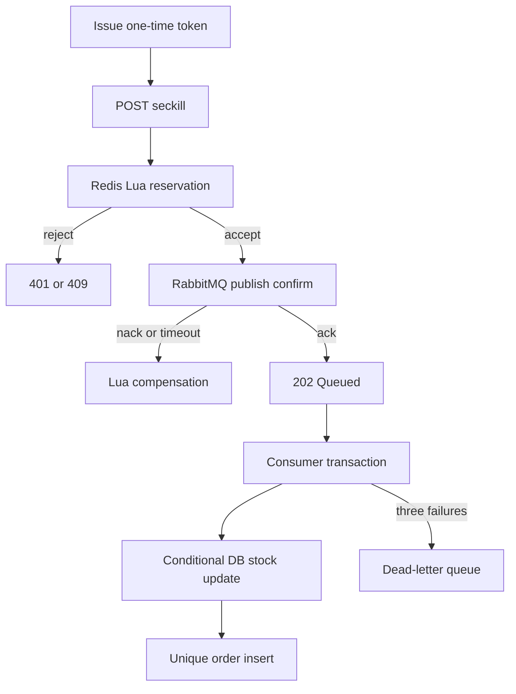

# FlashDeal

FlashDeal is a Java 21 flash-sale backend. It takes the genuinely interesting distributed-systems problem — keep a limited stock correct while the request path stays fast — and gives it an independently designed domain model, API, reliability contract, test suite, and load-test methodology.

## What is implemented

- short-lived, single-use seckill tokens to reject scripted or stale requests;
- Java 21 virtual threads for blocking request-path I/O;
- Redis + Lua atomic validation: token, remaining stock, and one-order-per-user;
- a Snowflake-style 64-bit order ID generator;
- durable RabbitMQ events with correlated publisher confirms;
- Redis reservation compensation when publishing is not confirmed;
- asynchronous MySQL persistence with a conditional stock update;
- idempotency through both order-ID and `(voucher_id, user_id)` unique constraints;
- three consumer attempts with exponential backoff, followed by a DLQ;
- Flyway migrations, Docker Compose, Testcontainers integration tests, and k6 load tests;
- Actuator health and metrics endpoints.

## Request path



### Why Redis and MySQL both protect stock

Redis is the admission-control layer: it prevents the database from receiving the traffic spike. MySQL remains the source of truth. Its `UPDATE ... WHERE stock > 0` and unique constraint protect correctness if Redis is stale, a message is redelivered, or multiple application instances race.

Redisson is intentionally **not** on the hot path. A per-user distributed lock would serialize requests and add another network round trip, while the Lua script and database constraints already provide the required atomicity and idempotency.

## Run locally

Prerequisites: Docker with Compose. A direct Maven build requires JDK 21.

```bash
docker compose up --build
```

RabbitMQ management UI: `http://localhost:15672` (`flashdeal` / `flashdeal`).

Create a one-time token and place an order:

```bash
TOKEN=$(curl -s -X POST \
  -H 'X-User-Id: 42' \
  http://localhost:8080/api/v1/vouchers/1/token | jq -r .token)

curl -i -X POST \
  -H 'X-User-Id: 42' \
  -H "X-Seckill-Token: $TOKEN" \
  http://localhost:8080/api/v1/vouchers/1/seckill
```

The endpoint returns `202 Accepted` because MySQL persistence happens asynchronously. Poll the URL in the `Location` header with the same `X-User-Id`.

## Tests

```bash
./mvnw verify
```

The wrapper downloads its own Maven, so a fresh clone needs only a JDK 21 and a
running Docker daemon (Testcontainers).

The integration test starts MySQL, Redis, and RabbitMQ with Testcontainers and verifies:

1. a valid reservation is eventually persisted;
2. the order state reaches `CREATED`;
3. a second order from the same user is rejected;
4. concurrent ID generation produces no duplicates.

## Load testing without inventing resume numbers

Everything below was produced by `load-tests/run-benchmark.sh`, which tears the stack
down (volumes included), rebuilds at a known replica count, waits for the gate to
answer through nginx, runs k6 **inside the compose network**, drains the queue, and
runs the reconciliation queries. Raw k6 summaries and reconciliation output are
committed under `load-tests/results/`.

```bash
./load-tests/run-benchmark.sh 1                      # baseline, through nginx
PEAK_RATE=20000 ./load-tests/run-benchmark.sh 3      # scaled, same offered load
```

### Measured results

Environment: Apple M4 Pro (12 cores), Docker Desktop limited to 12 CPUs / 8 GB,
git `bb14ad3`, 1,000 units of stock, 4 ramp stages of 25–30s each.
**One iteration issues two HTTP requests** (token, then seckill), so the seckill
rate is `http_reqs / 2`.

| Offered peak | Replicas | Seckill iters/s | HTTP req/s | P95 | Dropped iters | Peak VUs |
|---|---|---|---|---|---|---|
| 10K/s | 1 | 3,510 | 7,000 | **0.73 ms** | 207 | 19 |
| 10K/s | 3 | 3,508 | 6,993 | 1.34 ms | 489 | 19 |
| 20K/s | 1 | 4,931 | 9,771 | **470 ms** | 201,804 | 7,914 |
| 20K/s | 3 | **6,976** | **13,912** | **5.05 ms** | 3,598 | 744 |

Reading these together is the actual result, and it is more interesting than
"more replicas go faster":

- **At 10K/s offered, one replica is not the bottleneck.** It absorbs the whole ramp
  at sub-millisecond P95 and drops 207 of 421,276 iterations. Adding replicas here
  buys nothing and costs a little — three replicas plus the load generator plus MySQL,
  Redis and RabbitMQ all contend for the same 12 cores, so P95 gets *worse* (0.73 → 1.34 ms).
- **At 20K/s offered, one replica saturates.** P95 collapses to 470 ms, 202K iterations
  are dropped, and k6 inflates to 7,914 VUs waiting on responses — the classic queueing signature.
- **That is the point where horizontal scaling pays.** Three replicas at the same offered
  load deliver **+41% throughput (4,931 → 6,976 iters/s) and cut P95 by ~93× (470 → 5.05 ms)**,
  with dropped iterations falling 98% and VUs staying flat at 744.

### Correctness, reconciled rather than asserted

Every run above ended with `sold + remaining = 1000`, and `business_orders_accepted`
from k6 equalled `persisted_orders` in MySQL — so **zero oversells and zero lost orders**,
proven by query rather than claimed. `load-tests/reconcile.sql` also recovers the
Snowflake worker id from bits 12–21 of each order id, which shows the three replicas
minted non-colliding ids and that nginx spread the load evenly:

```text
snowflake_worker_id   orders_minted
215                   331
465                   326
555                   343
```

The load script deliberately sends a share of its traffic (`REPEAT_SHARE`, default 20%)
from a small pool of repeated user ids, so the one-order-per-user branch is actually
exercised under load; the duplicate-user query returns zero rows.

### Known limits of this measurement

- The load generator shares the same 12-core machine as the system under test. At an
  offered 40K/s the run collapses (874K dropped iterations, 60s timeouts) — that is **k6
  and the Docker bridge giving out, not the application**. Numbers above 20K/s on this
  host would measure the harness.
- Stock is 1,000, so after the first 1,000 reservations the remaining traffic exercises
  the *sold-out rejection* path, which is cheaper than a full reservation. The throughput
  figures are therefore admission-control throughput — which is the gate's job, but it is
  not the same as 4,900 successful orders per second.
- `http_req_failed` sits at 5–7% because concurrent requests from the same pooled user id
  race on the single-use token, so the loser gets a 401. That is expected behaviour of the
  token design under deliberately duplicated users, not a server error.

### What to record

Record three layers:

| Layer | Evidence |
|---|---|
| API | throughput, `http_req_failed`, seckill P50/P95/P99 |
| Business | accepted, sold-out/duplicate/invalid-token counts, MySQL order count |
| System | CPU/memory, Redis latency, RabbitMQ queue depth and redeliveries, MySQL connections |

After the queue drains, run `load-tests/reconcile.sql` and compare:

```text
initial stock - remaining MySQL stock = persisted unique orders
```

Do not claim “zero lost orders,” a particular P95, or a 10K-user capacity until the exported k6 result and reconciliation query prove it. Commit the result JSON alongside the exact Git SHA and environment description so the experiment is reproducible.

## Failure model

| Failure | Protection |
|---|---|
| concurrent requests | Lua executes atomically in Redis |
| duplicate user request | Redis buyers set plus DB unique constraint |
| publisher nack/timeout | correlated confirm plus Lua compensation |
| consumer crash before commit | broker redelivers |
| consumer crash after commit | idempotent consumer treats redelivery as success |
| transient consumer failure | 3 attempts with exponential backoff |
| poison message | republished to `flashdeal.orders.dead` |
| Redis/DB stock drift | DB conditional update preserves final correctness; reconciliation detects drift |

## Java 21 and virtual threads

Spring Boot virtual threads are enabled with `spring.threads.virtual.enabled=true`. They reduce the cost of waiting on blocking Redis, RabbitMQ, and JDBC calls, but they do not increase MySQL connection-pool capacity or replace admission control. Benchmark both enabled and disabled modes before making a performance claim:

```bash
# Enabled (project default)
docker compose up --build

# Platform-thread comparison
SPRING_THREADS_VIRTUAL_ENABLED=false docker compose up --build
```

Compare throughput, P95/P99, CPU, database-pool saturation, and RabbitMQ queue depth under the same k6 workload.

## Deliberate boundaries

- `X-User-Id` is a demo identity seam, not production authentication. Replace it with the subject from a verified JWT at an API gateway or Spring Security filter.
- The DLQ is observable and replayable, but automatic DLQ replay is intentionally excluded; blind replay can create a poison-message loop.
- Redis Cluster keys would need a shared hash tag (for example `{voucher:1}`) because one Lua script may only access keys in one hash slot.
- For a stricter guarantee across Redis and RabbitMQ, add a reservation/outbox log and a reconciliation worker. This version chooses low request latency plus explicit compensation.

## Design invariants

The whole design is organised around four invariants rather than around features:

1. stock never becomes negative;
2. a user receives at most one order per voucher;
3. accepted reservations either become an order or are visible for compensation;
4. redelivery never creates an additional order.

Everything else follows from those. Lua protects admission so the invariants are
enforced before any slow work happens, RabbitMQ moves database work off the request
path, and MySQL constraints provide final correctness even if Redis is stale or a
message is redelivered. The reconciliation queries in `load-tests/reconcile.sql`
exist to check invariants 1–4 against a real run rather than assert them in prose.
