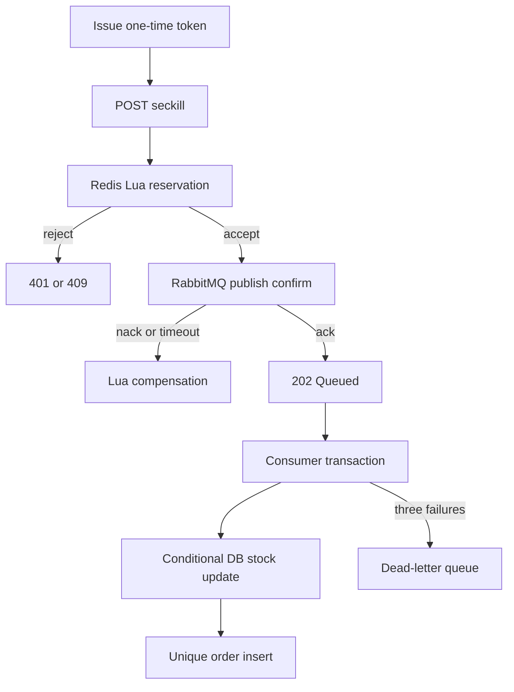

# FlashDeal

FlashDeal is a clean-room, interview-ready Java 21 flash-sale backend. It keeps the useful distributed-systems problem from tutorial projects while using an independently designed domain model, API, reliability contract, tests, and load-test methodology.

## What is implemented

- short-lived, single-use seckill tokens to reject scripted or stale requests;
- Java 21 virtual threads for blocking request-path I/O;
- Redis + Lua atomic validation: token, remaining stock, and one-order-per-user;
- a Snowflake-style 64-bit order ID generator;
- durable RabbitMQ events with correlated publisher confirms;
- Redis reservation compensation when publishing is not confirmed;
- asynchronous MySQL persistence with a conditional stock update;
- idempotency through both order-ID and `(voucher_id, user_id)` unique constraints;
- three consumer attempts with exponential backoff, followed by a DLQ;
- Flyway migrations, Docker Compose, Testcontainers integration tests, and k6 load tests;
- Actuator health and metrics endpoints.

## Request path



### Why Redis and MySQL both protect stock

Redis is the admission-control layer: it prevents the database from receiving the traffic spike. MySQL remains the source of truth. Its `UPDATE ... WHERE stock > 0` and unique constraint protect correctness if Redis is stale, a message is redelivered, or multiple application instances race.

Redisson is intentionally **not** on the hot path. A per-user distributed lock would serialize requests and add another network round trip, while the Lua script and database constraints already provide the required atomicity and idempotency.

## Run locally

Prerequisites: Docker with Compose. A direct Maven build requires JDK 21.

```bash
docker compose up --build
```

RabbitMQ management UI: `http://localhost:15672` (`flashdeal` / `flashdeal`).

Create a one-time token and place an order:

```bash
TOKEN=$(curl -s -X POST \
  -H 'X-User-Id: 42' \
  http://localhost:8080/api/v1/vouchers/1/token | jq -r .token)

curl -i -X POST \
  -H 'X-User-Id: 42' \
  -H "X-Seckill-Token: $TOKEN" \
  http://localhost:8080/api/v1/vouchers/1/seckill
```

The endpoint returns `202 Accepted` because MySQL persistence happens asynchronously. Poll the URL in the `Location` header with the same `X-User-Id`.

## Tests

```bash
mvn verify
```

The integration test starts MySQL, Redis, and RabbitMQ with Testcontainers and verifies:

1. a valid reservation is eventually persisted;
2. the order state reaches `CREATED`;
3. a second order from the same user is rejected;
4. concurrent ID generation produces no duplicates.

## Load testing without inventing resume numbers

Install [k6](https://grafana.com/docs/k6/latest/set-up/install-k6/), increase the seeded voucher stock for the intended run, restart with an empty MySQL volume/Redis instance, then run:

```bash
k6 run --summary-export load-tests/results/summary.json load-tests/seckill.js
```

The stages ramp through 1K, 3K, 5K, and 10K arrival iterations per second. Record three layers:

| Layer | Evidence |
|---|---|
| API | throughput, `http_req_failed`, seckill P50/P95/P99 |
| Business | accepted, sold-out/duplicate/invalid-token counts, MySQL order count |
| System | CPU/memory, Redis latency, RabbitMQ queue depth and redeliveries, MySQL connections |

After the queue drains, run `load-tests/reconcile.sql` and compare:

```text
initial stock - remaining MySQL stock = persisted unique orders
```

Do not claim “zero lost orders,” a particular P95, or a 10K-user capacity until the exported k6 result and reconciliation query prove it. Commit the result JSON alongside the exact Git SHA and environment description so the experiment is reproducible.

## Failure model

| Failure | Protection |
|---|---|
| concurrent requests | Lua executes atomically in Redis |
| duplicate user request | Redis buyers set plus DB unique constraint |
| publisher nack/timeout | correlated confirm plus Lua compensation |
| consumer crash before commit | broker redelivers |
| consumer crash after commit | idempotent consumer treats redelivery as success |
| transient consumer failure | 3 attempts with exponential backoff |
| poison message | republished to `flashdeal.orders.dead` |
| Redis/DB stock drift | DB conditional update preserves final correctness; reconciliation detects drift |

## Java 21 and virtual threads

Spring Boot virtual threads are enabled with `spring.threads.virtual.enabled=true`. They reduce the cost of waiting on blocking Redis, RabbitMQ, and JDBC calls, but they do not increase MySQL connection-pool capacity or replace admission control. Benchmark both enabled and disabled modes before making a performance claim:

```bash
# Enabled (project default)
docker compose up --build

# Platform-thread comparison
SPRING_THREADS_VIRTUAL_ENABLED=false docker compose up --build
```

Compare throughput, P95/P99, CPU, database-pool saturation, and RabbitMQ queue depth under the same k6 workload.

## Deliberate boundaries

- `X-User-Id` is a demo identity seam, not production authentication. Replace it with the subject from a verified JWT at an API gateway or Spring Security filter.
- The DLQ is observable and replayable, but automatic DLQ replay is intentionally excluded; blind replay can create a poison-message loop.
- Redis Cluster keys would need a shared hash tag (for example `{voucher:1}`) because one Lua script may only access keys in one hash slot.
- For a stricter guarantee across Redis and RabbitMQ, add a reservation/outbox log and a reconciliation worker. This version chooses low request latency plus explicit compensation.

## Interview narrative

Start from invariants, not products:

1. stock never becomes negative;
2. a user receives at most one order per voucher;
3. accepted reservations either become an order or are visible for compensation;
4. redelivery never creates an additional order.

Then explain how Lua protects admission, RabbitMQ moves database work off the request path, and MySQL constraints provide final correctness. Use measured load-test output—not aspirational numbers—in the resume.
