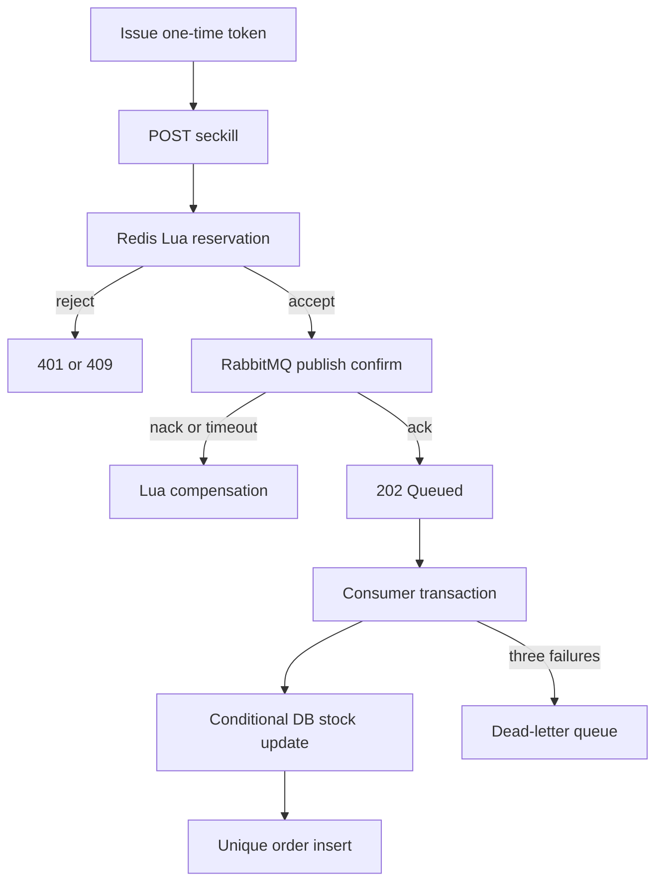
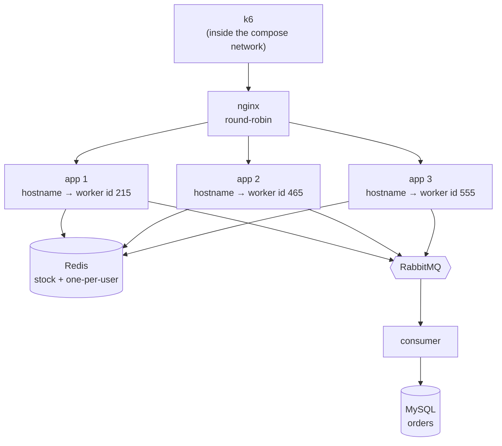

# FlashDeal

FlashDeal is a Java 21 flash-sale backend. It takes the genuinely interesting distributed-systems problem — keep a limited stock correct while the request path stays fast — and gives it an independently designed domain model, API, reliability contract, test suite, and load-test methodology.

## What is implemented

- short-lived, single-use seckill tokens to reject scripted or stale requests;
- Java 21 virtual threads for blocking request-path I/O, with a bounded RabbitMQ channel cache so they cannot deadlock on carrier pinning;
- Redis + Lua atomic validation: token, remaining stock, and one-order-per-user;
- a Snowflake-style 64-bit order ID generator;
- durable RabbitMQ events with correlated publisher confirms;
- Redis reservation compensation when publishing is not confirmed;
- asynchronous MySQL persistence with a conditional stock update;
- idempotency through both order-ID and `(voucher_id, user_id)` unique constraints;
- three consumer attempts with exponential backoff, followed by a DLQ;
- Flyway migrations, Docker Compose, Testcontainers integration tests, and k6 load tests;
- Actuator health and metrics endpoints.

## Request path


```mermaid
flowchart TD
    A[Issue one-time token] --> B[POST seckill]
    B --> C[Redis Lua reservation]
    C -->|reject| D[401 or 409]
    C -->|accept| E[RabbitMQ publish confirm]
    E -->|nack or timeout| F[Lua compensation]
    E -->|ack| G[202 Queued]
    G --> H[Consumer transaction]
    H --> I[Conditional DB stock update]
    I --> J[Unique order insert]
    H -->|three failures| K[Dead-letter queue]
```

### Why Redis and MySQL both protect stock

Redis is the admission-control layer: it prevents the database from receiving the traffic spike. MySQL remains the source of truth. Its `UPDATE ... WHERE stock > 0` and unique constraint protect correctness if Redis is stale, a message is redelivered, or multiple application instances race.

Redisson is intentionally **not** on the hot path. A per-user distributed lock would serialize requests and add another network round trip, while the Lua script and database constraints already provide the required atomicity and idempotency.

## Run locally

Prerequisites: Docker with Compose. A direct Maven build requires JDK 21.

```bash
docker compose up --build
```

RabbitMQ management UI: `http://localhost:15672` (`flashdeal` / `flashdeal`).

Create a one-time token and place an order:

```bash
TOKEN=$(curl -s -X POST \
  -H 'X-User-Id: 42' \
  http://localhost:8080/api/v1/vouchers/1/token | jq -r .token)

curl -i -X POST \
  -H 'X-User-Id: 42' \
  -H "X-Seckill-Token: $TOKEN" \
  http://localhost:8080/api/v1/vouchers/1/seckill
```

The endpoint returns `202 Accepted` because MySQL persistence happens asynchronously. Poll the URL in the `Location` header with the same `X-User-Id`.

## Tests

```bash
./mvnw verify
```

The wrapper downloads its own Maven, so a fresh clone needs only a JDK 21 and a
running Docker daemon (Testcontainers).

The integration test starts MySQL, Redis, and RabbitMQ with Testcontainers and verifies:

1. a valid reservation is eventually persisted;
2. the order state reaches `CREATED`;
3. a second order from the same user is rejected;
4. concurrent ID generation produces no duplicates.

## Running more than one replica

Nothing in the request path keeps per-user state in the JVM, so replicas are interchangeable — except
for one thing: they all mint order ids, and those ids must not collide.


```mermaid
flowchart TD
    K6["k6<br/>(inside the compose network)"] --> NG["nginx<br/>round-robin"]
    NG --> A1["app 1<br/>hostname → worker id 215"]
    NG --> A2["app 2<br/>hostname → worker id 465"]
    NG --> A3["app 3<br/>hostname → worker id 555"]
    A1 & A2 & A3 --> RD[("Redis<br/>stock + one-per-user")]
    A1 & A2 & A3 --> MQ{{"RabbitMQ"}}
    MQ --> CN["consumer"]
    CN --> DB[("MySQL<br/>orders")]
```

Each replica derives a **distinct 10-bit Snowflake worker id by hashing its container hostname**, so
scaling out needs no coordination service, no configuration per replica, and no shared counter — the
ids are unique because the hostnames are. An explicit `flashdeal.worker-id` still wins if you set one;
the hostname derivation is the fallback that makes `--scale app=N` just work.

That also makes the load balancer's behaviour observable after the fact. The worker id sits in bits
12–21 of every order id, so `reconcile.sql` recovers it and groups by it — see the distribution in
[Correctness, reconciled rather than asserted](#correctness-reconciled-rather-than-asserted).

## Load testing without inventing resume numbers

Everything below was produced by `load-tests/run-benchmark.sh`, which tears the stack
down (volumes included), rebuilds at a known replica count, waits for the gate to
answer through nginx, runs k6 **inside the compose network**, drains the queue, and
runs the reconciliation queries. Raw k6 summaries and reconciliation output are
committed under `load-tests/results/`.

```bash
PEAK_RATE=10000 ./load-tests/run-benchmark.sh 1      # baseline, through nginx
PEAK_RATE=10000 ./load-tests/run-benchmark.sh 3      # scaled, same offered load
```

Each app replica is capped at one CPU (`APP_CPUS`, default 1, in `docker-compose.scale.yml`)
and every image is pinned to an exact version. Without the cap, one replica on this host is
never the bottleneck — k6 and the Docker bridge give out first — so a 1-vs-3 comparison measures
whatever else the laptop happens to be doing. An earlier uncapped run (August) reported a 1→3
replica gain at 20K/s that could not be reproduced later for exactly that reason; it has been
replaced by the capped runs below.

### Measured results

Environment: Apple M4 Pro (12 cores), Docker Desktop limited to 12 CPUs / 8 GB, one CPU per
app replica, 1,000 units of stock, 4 ramp stages of 30s each (1K → 3K → 5K → 10K/s).
**One iteration issues two HTTP requests** (token, then seckill). Two runs per row, in
alternating order:

| Offered peak | Replicas | Iterations/s | HTTP req/s | Seckill P95 | Dropped iters | Peak VUs |
|---|---|---|---|---|---|---|
| 10K/s | 1 | 1,877 / 1,834 | 3,623 / 3,540 | **3.12 s / 3.49 s** | 139K / 146K | 18.9K / 18.1K |
| 10K/s | 3 | **3,510 / 3,356** | 6,999 / 6,671 | **1.16 ms / 11.6 ms** | 300 / 15.8K | 443 / 3.4K |

- **One replica on one core saturates.** P95 climbs to seconds, a third of the offered
  iterations are dropped, and k6 inflates to ~18K VUs waiting on responses — the queueing signature.
- **Three replicas absorb the whole ramp.** Throughput rises ~85% (≈1.86K → ≈3.43K
  iterations/s) and P95 falls from seconds to milliseconds. In the better run only 300 of
  421K iterations were dropped, so the 3-replica figure is bounded by the *offered* load,
  not by the app — the true ceiling is higher.

### Correctness, reconciled rather than asserted

Every run that drained ended with `sold + remaining = 1000`, and `business_orders_accepted`
from k6 equalled `persisted_orders` in MySQL — so **zero oversells and zero lost orders**,
proven by query rather than claimed. `load-tests/reconcile.sql` also recovers the
Snowflake worker id from bits 12–21 of each order id, which shows the three replicas
minted non-colliding ids and that nginx spread the load evenly:

```text
snowflake_worker_id   orders_minted
118                   363
351                   279
822                   358
```

The load script deliberately sends a share of its traffic (`REPEAT_SHARE`, default 20%)
from a small pool of repeated user ids, so the one-order-per-user branch is actually
exercised under load; the duplicate-user query returns zero rows.

### Known limits of this measurement

- The load generator shares the same 12-core machine as the system under test, which is
  why replicas are CPU-capped: the comparison is between 1 and 3 cores of app capacity,
  not a statement about what one JVM can do on a dedicated host.
- Stock is 1,000, so after the first 1,000 reservations the remaining traffic exercises
  the *sold-out rejection* path, which is cheaper than a full reservation. The throughput
  figures are therefore admission-control throughput — which is the gate's job, but it is
  not the same as that many successful orders per second.
- `http_req_failed` sits at 4–9% partly because concurrent requests from the same pooled user id
  race on the single-use token, so the loser gets a 401. That is expected behaviour of the
  token design under deliberately duplicated users, not a server error.

### What to record

Record three layers:

| Layer | Evidence |
|---|---|
| API | throughput, `http_req_failed`, seckill P50/P95/P99 |
| Business | accepted, sold-out/duplicate/invalid-token counts, MySQL order count |
| System | CPU/memory, Redis latency, RabbitMQ queue depth and redeliveries, MySQL connections |

After the queue drains, run `load-tests/reconcile.sql` and compare:

```text
initial stock - remaining MySQL stock = persisted unique orders
```

Do not claim “zero lost orders,” a particular P95, or a 10K-user capacity until the exported k6 result and reconciliation query prove it. Commit the result JSON alongside the exact Git SHA and environment description so the experiment is reproducible.

## Failure model

| Failure | Protection |
|---|---|
| concurrent requests | Lua executes atomically in Redis |
| duplicate user request | Redis buyers set plus DB unique constraint |
| publisher nack | correlated confirm plus Lua compensation |
| publisher confirm timeout (message may still land) | compensation and the consumer race on the order state with atomic Lua CAS: if compensation wins, the late message is dropped; if the consumer wins, compensation is a no-op and the request is accepted |
| consumer crash before commit | broker redelivers |
| consumer crash after commit | idempotent consumer treats redelivery as success |
| transient consumer failure | 3 attempts with exponential backoff |
| poison message | republished to `flashdeal.orders.dead` |
| Redis/DB stock drift | DB conditional update preserves final correctness; reconciliation detects drift |

## Java 21 and virtual threads

Spring Boot virtual threads are enabled with `spring.threads.virtual.enabled=true`. They reduce the cost of waiting on blocking Redis, RabbitMQ, and JDBC calls, but they do not increase MySQL connection-pool capacity or replace admission control. The compose file forwards the switch, so both modes can be benchmarked:

```bash
# Enabled (project default)
PEAK_RATE=20000 ./load-tests/run-benchmark.sh 1

# Platform-thread comparison
SPRING_THREADS_VIRTUAL_ENABLED=false PEAK_RATE=20000 ./load-tests/run-benchmark.sh 1
```

### A carrier-pinning deadlock found under load

With one CPU per replica and 20K/s offered, 3 of 6 runs froze for good: every endpoint
stopped answering, the consumer stopped acking (RabbitMQ eventually closed it with
`406 TIMEOUT WAITING FOR ACK`), and orders sat in the queue. Nothing was lost — the dead-letter
queue stayed empty and the backlog was intact — but nothing moved. Platform threads never froze.

A thread dump that includes virtual threads (`jcmd <pid> Thread.dump_to_file`, run from a JDK
sidecar because the runtime image is a JRE; saved as
`load-tests/results/vthread-dump-hang-20260929-201952.txt.gz`) showed the cycle:

1. Under burst load the channel cache (default 25) ran dry, so each request opened a new
   channel inside `RabbitTemplate.convertAndSend`.
2. amqp-client waits for `channel.open-ok` in `BlockingCell.get` using `synchronized` +
   `Object.wait()`. On JDK 21 that pins the virtual thread to its carrier, and the scheduler
   compensates with a new carrier — up to its cap of 256. The dump had exactly 256 virtual
   threads parked there, with 321 more queued behind them.
3. The reply needs traffic on the shared connection socket, whose write lock was held by a
   virtual thread that was runnable but had no free carrier to run on. Deadlock.

Fix: `spring.rabbitmq.cache.channel.size: 64` with `checkout-timeout: 1s` makes the cache a hard
limit, so excess publishers wait on a `Semaphore` (which unmounts cleanly) instead of each opening
a channel, and concurrent `channel.open` calls can never approach the carrier cap. After the change
the same 20K/s test passed 4 of 4 runs with `sold + remaining = 1000`, and the 10K/s results above
were re-measured with it in place. JDK 24+ (JEP 491) removes `synchronized` pinning altogether and
would be the longer-term fix.

## Deliberate boundaries

- `X-User-Id` is a demo identity seam, not production authentication. Replace it with the subject from a verified JWT at an API gateway or Spring Security filter.
- The DLQ is observable and replayable, but automatic DLQ replay is intentionally excluded; blind replay can create a poison-message loop.
- Redis Cluster keys would need a shared hash tag (for example `{voucher:1}`) because one Lua script may only access keys in one hash slot.
- For a stricter guarantee across Redis and RabbitMQ, add a reservation/outbox log and a reconciliation worker. This version chooses low request latency plus explicit compensation.

## Design invariants

The whole design is organised around four invariants rather than around features:

1. stock never becomes negative;
2. a user receives at most one order per voucher;
3. accepted reservations either become an order or are visible for compensation;
4. redelivery never creates an additional order.

Everything else follows from those. Lua protects admission so the invariants are
enforced before any slow work happens, RabbitMQ moves database work off the request
path, and MySQL constraints provide final correctness even if Redis is stale or a
message is redelivered. The reconciliation queries in `load-tests/reconcile.sql`
exist to check invariants 1–4 against a real run rather than assert them in prose.

---

## Related projects

- **[expense-approval](https://github.com/LijuanTang94/expense-approval)** — Approval workflow with department-scoped RBAC, deployed live
- **[care-plan-rag](https://github.com/LijuanTang94/care-plan-rag)** — Retrieval-grounded LLM service with a CI eval gate

More at **[github.com/LijuanTang94](https://github.com/LijuanTang94)**.
